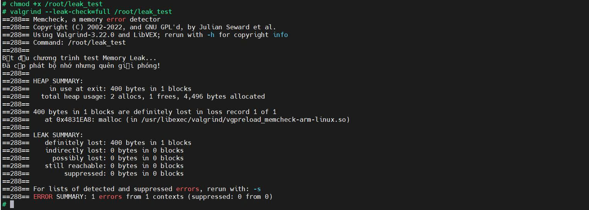
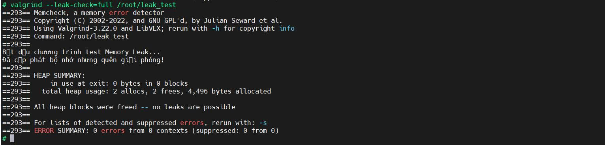
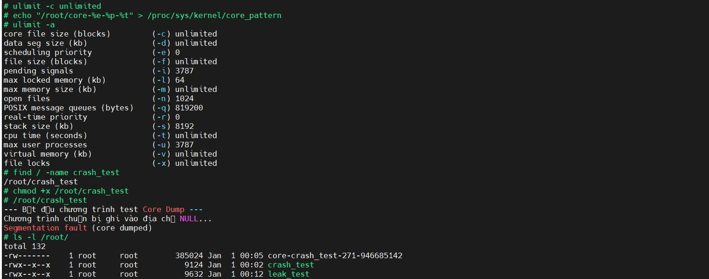
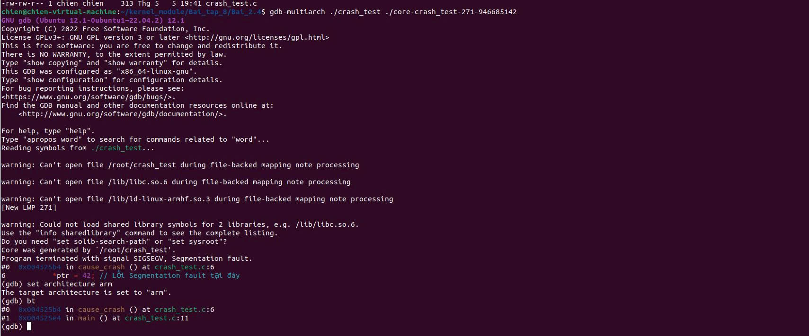
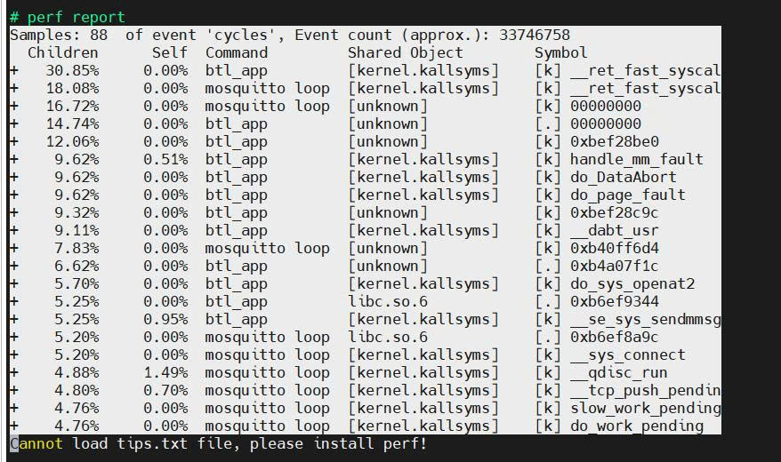

# TUẦN 7:  Sử dụng các công cụ gỡ lỗi và đánh giá hiệu năng cơ bản

## Bài 2.3:  Phân tích về Bộ nhớ
### Mục tiêu: Tạo một chương trình C có lỗi rò rỉ bộ nhớ (Memory Leak). Sử dụng công cụ Valgrind trên hệ điều hành nhúng (Buildroot) để phát hiện lỗi. Phân tích log của Valgrind, xác định điểm gây lỗi và thực hiện vá lỗi.

### Các bước thực hiện
#### Bước 1: Kích hoạt Valgrind vào hệ điều hành của BBB.
- Vào giao diện cấu hình: ```make memenuconfig```.
- Di chuyển theo đường dẫn: `Target packages` -> `Debugging, profiling and benchmark`
- Tìm và tích chọn: `[*] valgrind`
- Lưu lại và thoát
- Biên dịch để cập nhật gói mới: ```make```
#### Bước 2: Tạo chương trình lỗi Leak Memory
- Đứng ở thư mục:`~/kernel_module/Bai_tap_8/Bai_2.3$` tạo file `leak_test.c` có nội dung:
```
#include <stdio.h>
#include <stdlib.h>

void tạo_lỗi_leak() {
    // Cấp phát 100 bytes nhưng không bao giờ free
    int *ptr = (int *)malloc(100 * sizeof(int));
    
    if (ptr == NULL) return;

    for (int i = 0; i < 100; i++) {
        ptr[i] = i;
    }
    printf("Đã cấp phát bộ nhớ nhưng quên giải phóng!\n");
    // Lẽ ra phải có free(ptr); ở đây
}

int main() {
    printf("Bắt đầu chương trình test Memory Leak...\n");
    tạo_lỗi_leak();
    return 0;
}
```
- Biên dịch chương trình:
```
/home/chien/buildroot/buildroot/output/host/bin/arm-buildroot-linux-gnueabihf-gcc -g leak_test.c -o leak_test
```
  - Giải thích các tham số:
    - `-g`: Bắt buộc phải có. Nó giúp nhúng thông tin về số dòng, tên hàm vào file thực thi. Nếu không có -g, Valgrind chỉ báo lỗi ở một địa chỉ bộ nhớ.
    - `-o leak_test`: Tên file đầu ra sau khi biên dịch
#### Bước 3: Copy file sang BBB
- Sau khi có file `leak_test`, đẩy sang board:
```
scp leak_test root@192.168.7.2:/root/
```
#### Bước 4: Chạy Valgrind và phân tích
- Trên terminal của BBB, thực hiện lệnh:
```
chmod +x leak_test
valgrind --leak-check=full ./leak_test
```

#### Kết quả


- Phân tích thông số quan trọng:
  - `in use at exit: 400 bytes in 1 blocks`: Khi chương trình kết thúc, vẫn còn 400 bytes đang bị chiếm dụng trong bộ nhớ RAM mà chưa được trả lại cho hệ điều hành.
  - `total heap usage: 2 allocs, 1 frees`: Chương trình đã thực hiện 2 lần cấp phát (malloc) nhưng chỉ có 1 lần giải phóng (free). Đây chính là nguyên nhân gây ra "leak".
  - `definitely lost: 400 bytes in 1 blocks`: Valgrind khẳng định 100% là 400 bytes này đã bị mất dấu, không có con trỏ nào quản lý chúng nữa.

#### Bước 5: Vá lỗi
- Chỉnh sửa file `leak_test.c` như sau:
```
void tạo_lỗi_leak() {
    int *ptr = (int *)malloc(100 * sizeof(int));
    if (ptr == NULL) return;

    for (int i = 0; i < 100; i++) {
        ptr[i] = i;
    }
    printf("Đã cấp phát bộ nhớ và sẽ được giải phóng ngay sau đây!\n");

    // --- VÁ LỖI TẠI ĐÂY ---
    free(ptr); 
    // -----------------------
}
```
- Lặp lại quy trình cũ: Biên dịch lại, copy lên BBB và chạy lại Valgrind.
#### Kết quả


- Phân tích thông số quan trọng:
  - `in use at exit: 0 bytes in 0 blocks`: Nghĩa là khi chương trình kết thúc, không còn một byte nào bị "kẹt" lại trong RAM.
  - `total heap usage: 2 allocs, 2 frees`: Số lần giải phóng (frees) đã bằng khớp với số lần cấp phát (allocs).
  - `All heap blocks were freed -- no leaks are possible`: Đây là câu khẳng định quan trọng nhất từ Valgrind, xác nhận chương trình của bạn đã sạch hoàn toàn lỗi leak.
  - `ERROR SUMMARY: 0 errors from 0 contexts:` Không còn bất kỳ lỗi nào được phát hiện.

## Bài 2.4: Phân tích Core Dump
### Mục tiêu: Sử dụng file Core Dump để xác định nguyên nhân chương trình bị Crash.
### Các bước thực hiện:
#### Bước 1: Thiết lập môi trường trên BBB:
- Cho phép tạo file core không giới hạn kích thước: `ulimit -c unlimited`.
- Cấu hình định dạng tên file core: `echo "/root/core-%e-%p-%t" > /proc/sys/kernel/core_pattern`.

#### Bước 2: Tạo lỗi giả lập
- Viết chương trình `crash_test.c` thực hiện ghi giá trị vào con trỏ NULL.
```
#include <stdio.h>

void cause_crash() {
    int *ptr = NULL;
    printf("Chương trình chuẩn bị ghi vào địa chỉ NULL...\n");
    *ptr = 42; // Lỗi Segmentation fault tại đây
}

int main() {
    printf("--- Bắt đầu chương trình test Core Dump ---\n");
    cause_crash();
    return 0;
}
```
- Biên dịch với cờ `-g` để hỗ trợ debug: `arm-buildroot-linux-gnueabihf-gcc -g crash_test.c -o crash_test`.

#### Bước 3: Thu thập dữ liệu
- Chạy chương trình trên BBB, nhận thông báo `Segmentation fault (core dumped)`.
- Sử dụng `scp` để lấy file `core-crash_test-271-946685142` về máy Ubuntu.


#### Bước 4: Phân tích lỗi với GDB
- Sử dụng công cụ `gdb-multiarch`.
- Lệnh `bt` xác định lỗi tại: Hàm `cause_crash()`, dòng 6, file `crash_test.c`.


- Phân tích kết quả:
  - `Program terminated with signal SIGSEGV, Segmentation fault`: GDB xác nhận chương trình bị đóng bởi hệ điều hành do lỗi vi phạm vùng nhớ (Segmentation fault).
  - `#0 0x004525b4 in cause_crash () at crash_test.c:6`: Đây là "chìa khóa" của bài tập. GDB chỉ đích danh địa chỉ thanh ghi lệnh và vị trí lỗi nằm tại hàm `cause_crash`, dòng số 6 của file `crash_test.c`.
  - `6 *ptr = 42;`: GDB hiển thị luôn dòng code gây tội. Việc bạn ghi giá trị 42 vào con trỏ `ptr` (vốn đang bằng `NULL`) chính là nguyên nhân gây crash.
  - `#1 0x004525e4 in main () at crash_test.c:11`: Lệnh `bt` (backtrace) còn cho bạn biết "lịch sử" cuộc gọi: Hàm `main` đã gọi hàm `cause_crash` tại dòng 11 trước khi sự cố xảy ra.

## Bài 2.5: Phân tích hiệu năng
### Mục tiêu:
- Sử dụng công cụ `perf` để giám sát hoạt động thực thi của ứng dụng `btl_app`.
- Xác định các hàm chiếm dụng CPU cao để đưa ra nhận xét về hiệu năng.

### Quá trình thực hiện
#### Bước 1: Kích hoạt `perf` trong Buildroot
- Di chuyển đến mục Linux Kernel (ngay dưới mục Build options).
- Tìm dòng Linux Kernel Tools và nhấn `Space` để chọn `[*]`.
- Nhấn `Enter` để vào bên trong mục đó.
- Tại đây, sẽ thấy dòng `perf`. Hãy nhấn `Space` để chọn `[*] perf`.
#### Bước 2: Thiết lập môi trường đo lường
- Mở quyền truy cập sự kiện Kernel: `echo -1 > /proc/sys/kernel/perf_event_paranoid`
- Thiết lập tần suất lấy mẫu: `echo 2000 > /proc/sys/kernel/perf_event_max_sample_rate`
#### Bước 3: Đo và ghi lại dữ liệu:
```
perf record -g ./btl_app
```
- Giải thích:
  - Cờ `-g` giúp lưu lại đồ thị gọi hàm (call-graph) để phân tích sâu sau này.
  - Chương trình sẽ tự động khởi chạy. Hãy để chương trình hoạt động trong khoảng 20-30 giây để `perf` thu thập đủ mẫu (samples).

#### Bước 4: Phân tích và đọc báo cáo hiệu năng
- Sử dụng lệnh `perf report` để xem kết quả phân tích ngay trên terminal:
- Lệnh thực hiện: `perf report`

- Phân tích kết quả:
  - Hàm hệ thống chiếm dụng cao: `__ret_fast_syscall` chiếm tỷ lệ lớn nhất (hơn 30% cho `btl_app`). Điều này cho thấy CPU đang dành nhiều thời gian xử lý các lời gọi hệ thống (system calls) liên tục.
  - Hoạt động mạng: Sự xuất hiện của `mosquitto loop`, `__sys_connect` và `__tcp_push_pending` minh chứng cho việc chương trình đang nỗ lực thực hiện các tác vụ mạng MQTT.
  - Xử lý lỗi: Các hàm như `do_page_fault` và `do_DataAbort` chiếm khoảng 9.62%, phản ánh việc hệ thống phải xử lý các lỗi bộ nhớ phát sinh khi thực hiện retry liên tục.
#### Bước 5: Xuất báo cáo để nộp bài
- Lệnh thực hiện: `perf report --stdio > report_perf.txt`

